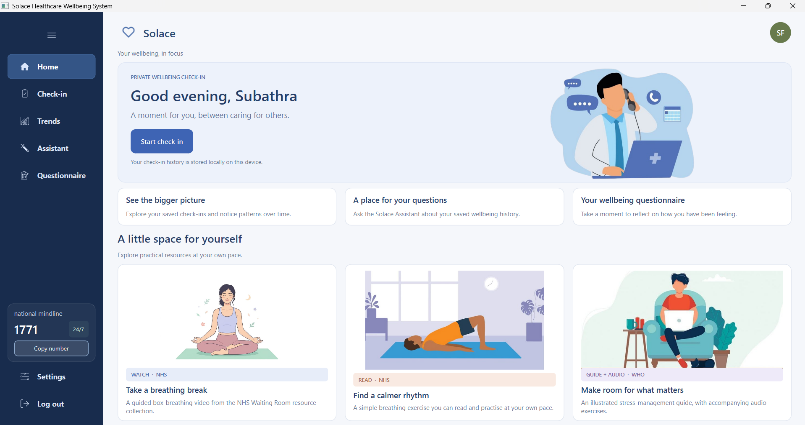
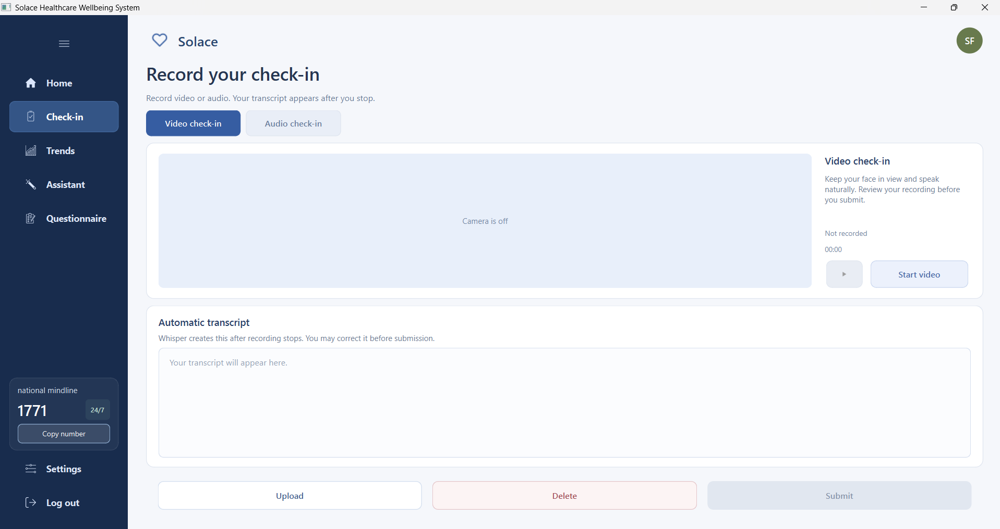
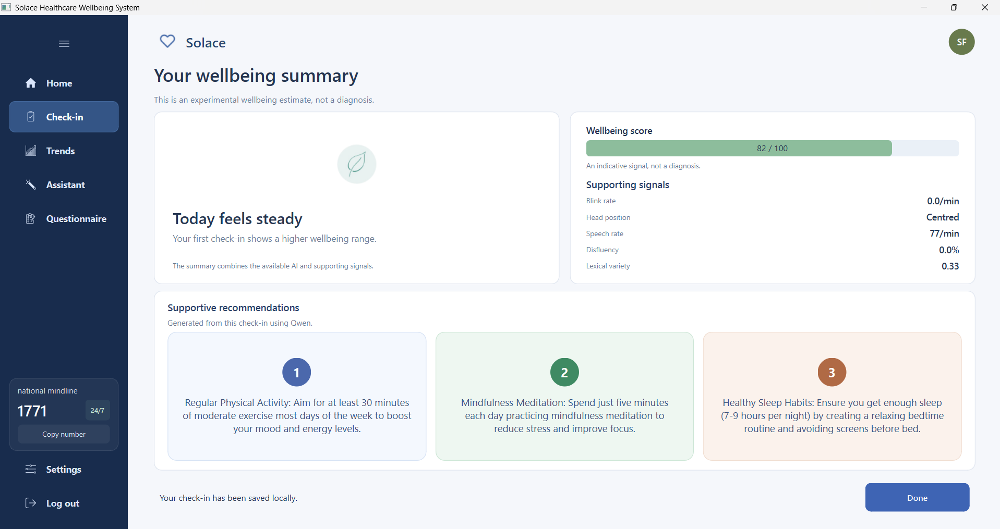
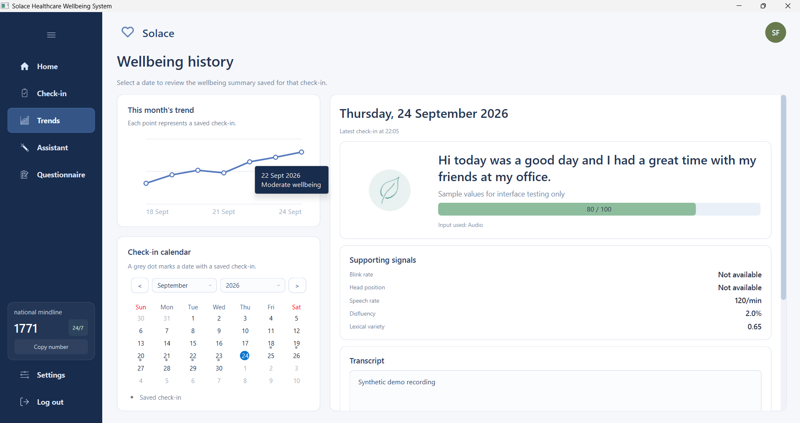
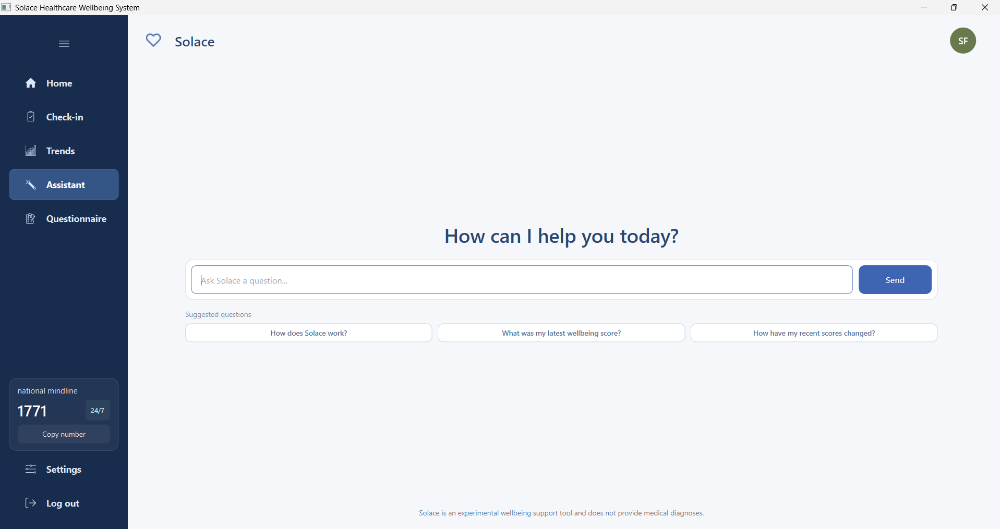
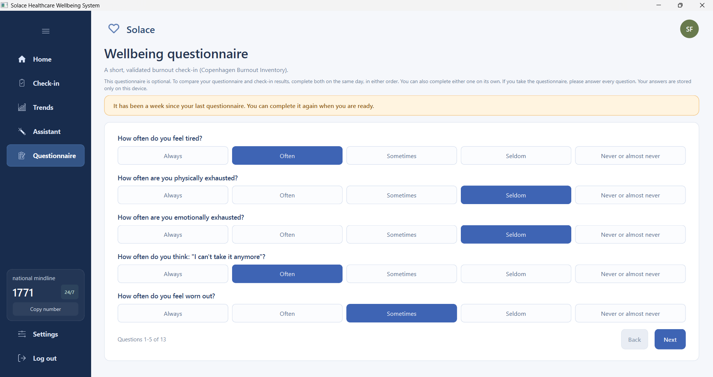

# Solace - Healthcare Worker Burnout-Related Wellbeing Monitoring
A local, multimodal AI desktop application that transforms a one-minute audio or video check-in into a private wellbeing indicator, a trend over time, a supportive recommendation, and a chat assistant to help healthcare workers detect early, burnout-related strain.

## Overview
Solace orchestrates six pre-trained models for text, audio, vision, transcription, translation and language generation. A single short check-in generates a fused wellbeing score, which is compared to the user’s personal baseline to flag an early-warning signal, and a brief, non-diagnostic recommendation. All processing is local to the user's device raw audio and video are analysed and then discarded, and only derived scores and text are stored. Check-in and recommendations can be done in English, Malay, Chinese and Tamil. Solace is an early-awareness tool, **not** a medical diagnostic service.

## Features

- One-minute **audio or video** check-in with live transcription
- **Six-model** multimodal pipeline (text, audio, vision, transcription, translation, recommendation)
- **Median fusion** with supporting behavioural signals into a single wellbeing score
- **Personal-baseline** early-warning detection (rolling mean + standard deviation)
- **Multilingual** interface and output (English / Malay / Chinese / Tamil)
- **Tool-routing assistant** that answers questions about your own check-in history, with a fixed safety response for crisis messages
- In-app **Copenhagen Burnout Inventory (CBI)** questionnaire
- **Fully local** processing with PDPA aligned privacy and PBKDF2 password hashing

## Screenshots

| Home | Check-in | Result |
|------|----------|--------|
|  |  |  |

| Trends | Assistant | Questionnaire |
|--------|-----------|---------------|
|  |  |  |

## Tech Stack
- Python 3.11 
- PySide6 (Qt)
- PyTorch
- Hugging Face Transformers
- Whisper-Small
- NLLB-200
- Qwen2.5-1.5B
- RoBERTa-Large
- MERaLiON-SER
- DDAMFN++
- SQLite
- MediaPipe
- OpenCV
- NLTK
- scikit-learn
- Librosa
- Pandas
- Matplotlib
- PyTest
- imageio-ffmpeg (bundled FFmpeg for audio extraction)

## Setup & Run

**Prerequisites:** Python 3.11, Git, FFmpeg, and an internet connection for the first run (the pre-trained models download from Hugging Face and GitHub on first use and require several GB of disk space).
```bash
# 1. Clone the repository
git clone https://github.com/SubathraSIM/CM3020_Solace_Wellbeing_Monitoring_FYP.git
cd CM3020_Solace_Wellbeing_Monitoring_FYP

# 2. Create and activate virtual environment
python -m venv venv
# Windows:
venv\Scripts\activate
# macOS / Linux:
source venv/bin/activate

# 3. Install FFmpeg (needed to read compressed audio/video uploads)
# Windows (PowerShell):
winget install Gyan.FFmpeg
# macOS (Homebrew):
brew install ffmpeg

# 4. Install dependencies
pip install -r requirements.txt

# 5. Run application
python main.py
```

## Data Availability

- **data/processed/** - the processed datasets used for model evaluation are included, so the model comparison results can be reproduced.
- **data/raw/Functional_Testing/** - the raw recordings for Functional Testing are **not included** due to their large size. Their processed versions are available in **data/processed/**.
- **User check-in videos and signed consent forms are not included** for privacy and ethics reasons. As a result, the **cbi_validation.ipynb notebook cannot be re-run end-to-end**, because it depends on the participants' original recordings, which are not shared.

## Testing
The deterministic core is covered by **78 unit tests** (fusion maths, baseline logic, assistant routing, database, translation). Run them with:
```bash
python -m pytest Unit_test/ -v
```

## License & Author
**Author:** Subathra Sundarbabu

This project is intended for educational and research purposes.